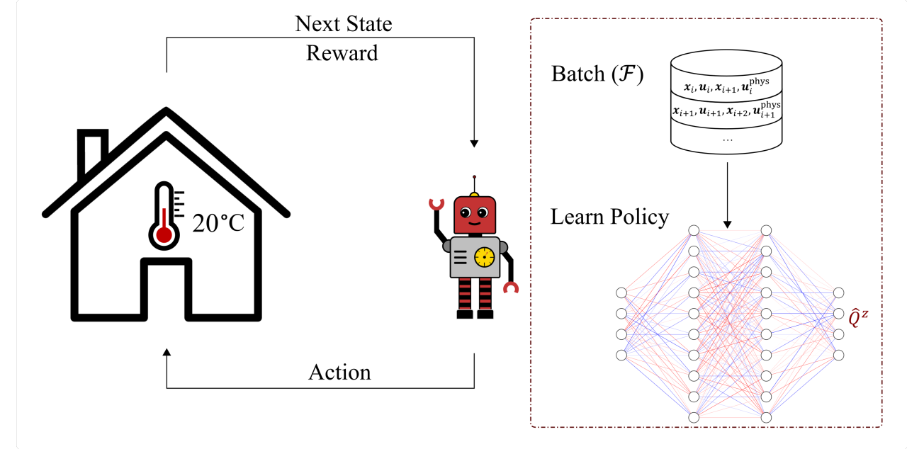
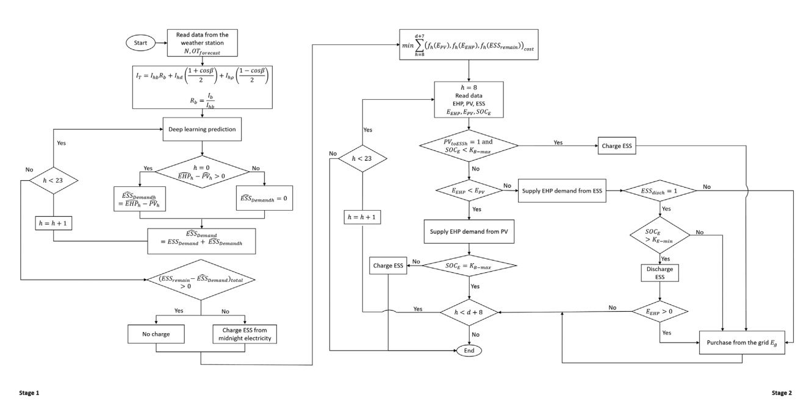
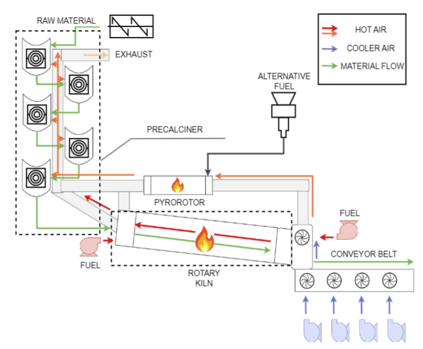

#

## Tech Stack

<table>
  <tr>
    <td></td>
    <td ></td>
    <td></td>
    <td></td>
    <td></td>
  </tr>
  <tr>
    <td></td>
    <td></td>
    <td></td>
    <td></td>
    <td></td>
  </tr>
  <tr>
    <td></td>
    <td></td>
    <td></td>
    <td></td>
    <td></td>
  </tr>
  <tr>
    <td></td>
    <td></td>
    <td></td>
    <td></td>
    <td></td>
    
  </tr>
  <tr>
    <td></td>
    <td></td>
    <td></td>
    <td></td>
    <td></td>
  </tr>
</table> 

## Past Projects
### Reinforcement Learning

        

This project aimed at developing and implementing AI-powered HVAC systems to optimize energy efficiency in commercial buildings. By leveraging advanced machine learning algorithms and real-time data analysis, the system dynamically adjusted heating, ventilation, and air conditioning settings to match occupancy patterns and environmental conditions. As a result, energy consumption was reduced by 13-23%, contributing to significant cost savings and sustainability improvements. This initiative not only enhanced operational efficiency but also set new benchmarks for energy optimization in the industry.
 

### AI-based control algorithm for integrating PV, ESS, and EHP

      

This project aimed at developing an integrated energy-efficient system combining photovoltaic (PV), energy storage systems (ESS), and electric heat pumps (EHP) to maximize PV energy utilization, optimize ESS operation, and reduce EHP energy consumption costs. I implemented deep learning (DL)-based forecasting algorithms for accurate prediction of PV energy generation and EHP demand (achieving an R² above 0.95). The system strategically schedules ESS charging/discharging according to forecasted demands and peak loads. Applied to a retail shop over 10 months, the system demonstrated a 12% reduction in annual electricity costs, equivalent to savings of 1,285,291 Won, effectively decreasing dependency on fossil fuels.
 

### Predicting NOx concentrations in a cement kiln

           

This project aimed to develop a machine learning model capable of predicting the amount of NOx emitted in a cement kiln. The model is designed to analyze various operational parameters and environmental factors to enhance accuracy and support emission control strategies.
 

