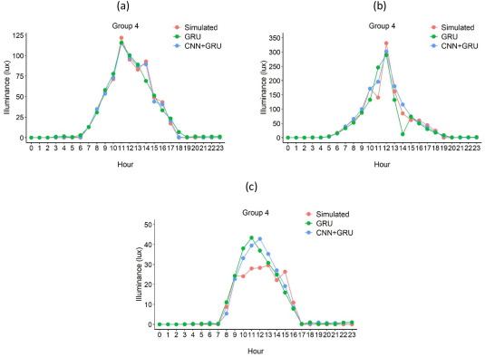

# Portfolio

## Tech Stack

<table>
  <tr>
    <td></td>
    <td ></td>
    <td></td>
    <td></td>
    <td></td>
  </tr>
  <tr>
    <td></td>
    <td></td>
    <td></td>
    <td></td>
    <td></td>
  </tr>
  <tr>
    <td></td>
    <td></td>
    <td></td>
    <td></td>
    <td></td>
  </tr>
  <tr>
    <td></td>
    <td></td>
    <td></td>
    <td></td>
    <td></td>
    
  </tr>
  <tr>
    <td></td>
    <td></td>
    <td></td>
    <td></td>
    <td></td>
  </tr>
</table> 

## Past Projects
### Reinforcement learning for optimizing energy consumption in commercial buildings

        

This project aimed at developing and implementing AI-powered heating and cooling systems to optimize energy efficiency in commercial buildings. By leveraging advanced machine learning algorithms and real-time data analysis, the system dynamically adjusted heating, ventilation, and air conditioning settings to match occupancy patterns and environmental conditions. As a result, energy consumption was reduced by 13-23%, contributing to significant cost savings and sustainability improvements. This initiative not only enhanced operational efficiency but also set new benchmarks for energy optimization in the industry.
 

### Commodity price long-term forecasting with Explainable AI

            
 

Long-term forecasting of precious metals provides stakeholders with valuable insights for strategic planning, risk management, and investment decisions by anticipating future market trends. To support this, machine learning models were developed to predict daily prices one year ahead, and explainable AI techniques were applied to identify key influencing factors, enabling stakeholders to understand price drivers and make informed, data-driven decisions.
 

### Machine learning-based building energy benchmarking

            

This project developed energy benchmarking models for approximately 3,000 Korean public buildings to support building renovation efforts. Using data collected via REST APIs and web crawling, quantile regression models were trained on features such as building size, age, and local climate. A user-friendly workflow retrieves building and weather data, predicts energy use, and benchmarks a building’s performance against similar facilities, enabling data-driven energy efficiency evaluations.
 

### Efficient data center cooling using model predictive control

        

This project aimed to evaluate the feasibility of automating cooling in a data center server room to reduce energy consumption without risking servers overheating. The server room, containing 26 servers, was cooled by 9 CRAC units. Machine learning models were developed to estimate thermal transients. A Model Predictive Control (MPC) system was implemented to optimize temperature setpoints, reducing unnecessary cooling. Initial results showed that the MPC maintained server temperatures below 25°C, confirming the method’s effectiveness and energy-saving potential.
 

### AI-based control algorithm for integrating photovoltaics, energy storage systems, and electric heat pumps

        

This project aimed at developing an integrated energy-efficient system combining photovoltaic (PV), energy storage systems (ESS), and electric heat pumps (EHP) to maximize PV energy utilization, optimize ESS operation, and reduce EHP energy consumption costs. I implemented deep learning (DL)-based forecasting algorithms for accurate prediction of PV energy generation and EHP demand (achieving an R² above 0.95). The system strategically schedules ESS charging/discharging according to forecasted demands and peak loads. Applied to a retail shop over 10 months, the system demonstrated a 12% reduction in annual electricity costs, equivalent to savings of 1,285,291 Won, effectively decreasing dependency on fossil fuels.
 

### Predicting NOx concentrations in a cement kiln

           

This project aimed to develop a machine learning model capable of predicting the amount of NOx emitted in a cement kiln. The model is designed to analyze various operational parameters and environmental factors to enhance accuracy and support emission control strategies.
 

### Machine learning causal analysis of cooling energy use

            

In this project, domain knowledge, machine learning, and causal inference were utilized to assess the impact of energy policies and occupant behavior on cooling energy consumption. The key findings indicate that energy policies such as energy audits, proper insulation, access to interval data, and the use of Energy Star-qualified windows significantly reduce energy use intensity (EUI). Additionally, occupant behavior, particularly air conditioning usage, has a causal effect on EUI. For example, proper insulation can reduce EUI by 5.603 kWh/m², while adjusting static thermostat settings to automatic adjustments at specific times can reduce EUI by 3.542 kWh/m².
 

### Forecasting outdoor air pollutants in Sydney

            

This project aimed at forecasting outdoor air pollutants for the city of Sydney, beginning with data preprocessing to clean and prepare datasets, including normalization and handling missing values. Subsequently, Long Short-Term Memory (LSTM) models were developed to predict pollutant levels based on historical meteorological data. Extensive performance testing was conducted across 110 different LSTM models to evaluate their effectiveness for various pollutants and environmental conditions. The analysis also investigated the optimal number of meteorological sensors required for effective air quality management. Additionally, the impact of extreme conditions, such as bushfires and COVID-19 lockdowns, on pollutant predictability was assessed, along with an exploration of forecasting capabilities under both standard and exceptional circumstances.
 

### Machine learning for daylight prediction

            

This project aimed at developing machine learning models, specifically CNN, GRU, and hybrid CNN-GRU architectures, to accurately predict indoor illuminance. I optimized model performance through meticulous parameter tuning, evaluating accuracy with metrics such as R², RMSE, and MAE. Additionally, I assessed the models' generalization capabilities on unseen data and conducted analysis based on grouped illuminance sensors. Computational efficiency was also evaluated, comparing the models in terms of training duration, prediction speed, and model size, ensuring optimal balance between accuracy and performance
 

### Forecasting urban heat intensity in Sydney Using LSTM Models

            

This project aimed at analyzing and forecasting Urban Heat Island (UHI) intensity in Sydney by leveraging hourly air temperature data collected over 18 years from eight monitoring sites. I performed comprehensive data quality control and investigated temporal UHI variations—diurnal, monthly, seasonal, and annual—by comparing urban areas with suburban and rural reference locations. I developed two Long Short-Term Memory (LSTM) models: one utilizing ambient temperature alone (LSTM_T), and another incorporating both air temperature and wind speed (LSTM_W). Model parameters were optimized through iterative trials, with performance validated using RMSE, MAE, and R² metrics. The resulting analysis revealed critical UHI trends, highlighting the influence of diurnal and seasonal factors and spatial variations across monitoring stations.
 

